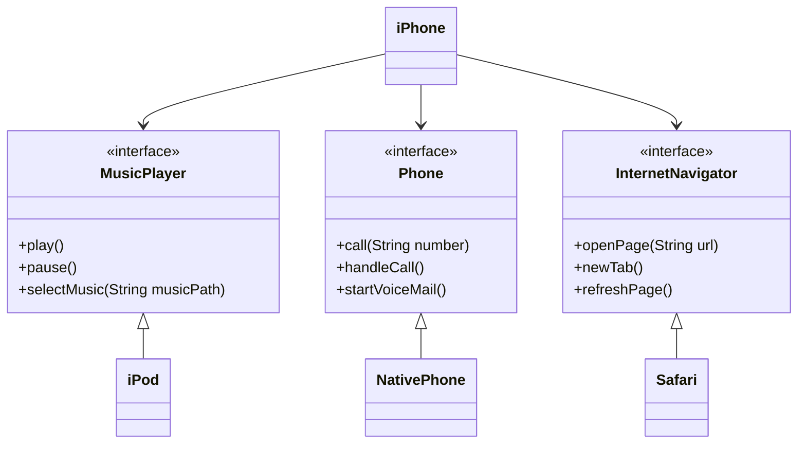

```mermaid
classDiagram
    class MusicPlayer {
        <<interface>>
        +play()
        +pause()
        +selectMusic(String musicPath)
    }

    class Phone {
        <<interface>>
        +call(String number)
        +handleCall()
        +startVoiceMail()
    }

    class InternetNavigator {
        <<interface>>
        +openPage(String url)
        +newTab()
        +refreshPage()
    }

    class iPhone {
    }
    
    class iPod {
    }
    
    class NativePhone {
    }
    
    class Safari {
    }

    iPhone --> MusicPlayer
    iPhone --> Phone
    iPhone --> InternetNavigator
    MusicPlayer <|-- iPod
    Phone <|-- NativePhone
    InternetNavigator <|-- Safari
```
